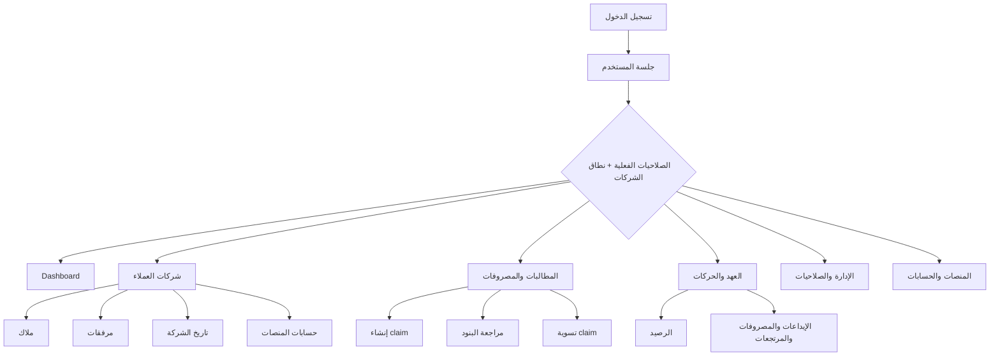
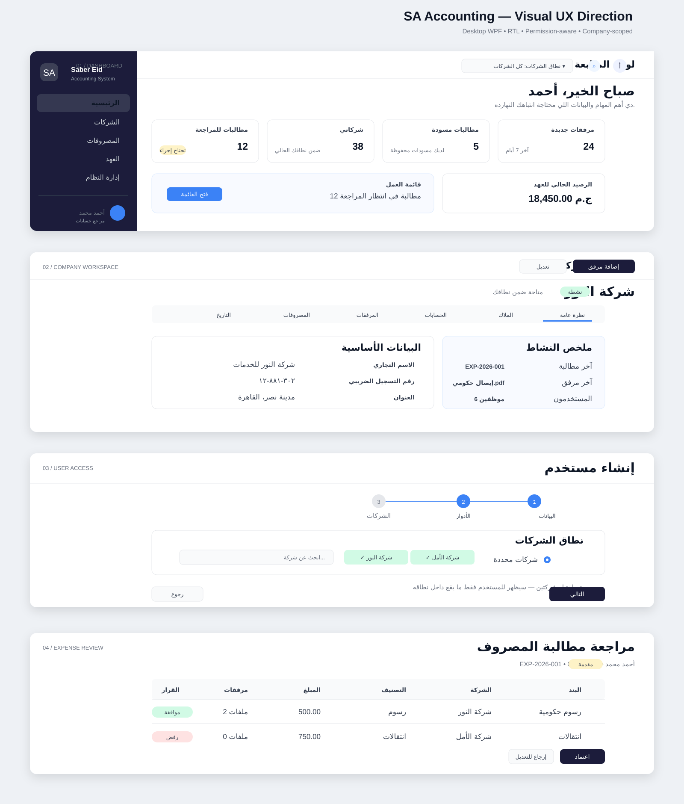

# SA Accounting — UX Blueprint قبل تنفيذ WPF

> حالة الوثيقة: تصور UX أولي قابل للمراجعة
>
> نطاق المرحلة: فهم المنتج، ضبط الـ information architecture، وتحديد القرارات المطلوبة قبل الـ UI التفصيلي.
>
> لا تحتوي هذه الوثيقة على كود واجهة.

## 1. الخلاصة التنفيذية

SA Accounting هو نظام desktop لإدارة مكتب محاسبة/محاماة، ومركزه الحقيقي هو **شركة العميل**. كل ما يحدث في المكتب يرتبط بشركة: بياناتها، ملاكها، حساباتها على المنصات، مستنداتها، وبنود مصروفات الموظفين.

التصميم المقترح يعتمد على ثلاثة محاور:

1. **Company workspace**: كل شاشة تشغيلية تعرض سياق الشركة بوضوح.
2. **Permission-aware UI**: نفس الشاشة متاحة للمستخدمين، لكن البيانات والأفعال والـ panels تتغير حسب الصلاحيات الفعلية.
3. **Workflows واضحة**: المصروف ينتقل من Draft إلى Submitted ثم Review ثم Settlement، مع فصل المراجعة عن التسوية المالية.

القرار الأهم قبل بدء التنفيذ: اعتماد نموذج موحد يفرق صراحة بين:

- الصلاحية: ماذا يستطيع المستخدم أن يفعل؟
- نطاق الشركات: أين يستطيع أن يفعل ذلك؟
- صلاحياته الفعلية: role permissions بعد تطبيق user denied overrides.

## 2. ما تمت مراجعته

تمت مراجعة:

- ملفات `sa-accounting-docs/project-context/01` إلى `10`.
- الـ ERD وملاحظات الـ domain model.
- Backend entities, enums, commands, handlers, contracts, controllers.
- الـ WPF views/view-models الحالية، والـ navigation والـ permission converter.
- الـ colors والـ layout styles الموجودة في WPF.

الـ baseline الموثّق موجود في:

- `07-permission-based-flows.md`
- `08-system-module-flows.md`
- `09-authentication-flow-spec.md`
- `10-user-management-flow-spec.md`

## 3. قراءة المنتج الحالية

### 3.1 النظام كما ينبغي أن يفهمه المستخدم



### 3.2 الموديولات

| المجال | المسؤولية | مركزه في الـ UX |
|---|---|---|
| Authentication | login, eligibility, session | بوابة الدخول + حالات الجلسة |
| Dashboard | ملخص العمل والتنبيهات | نقطة البداية حسب صلاحيات المستخدم |
| Companies | بيانات العميل وسياقه | workspace رئيسي |
| Owners | ملاك الشركة | tab داخل company |
| Attachments | مستندات الشركة/المطالبة | tab أو section داخل السياق |
| Expense Claims | تسجيل ومراجعة المطالبات | workflow تشغيلي رئيسي |
| Custody | العهد والحركات والرصيد | workflow مالي منفصل |
| Platforms | تعريف المنصات | إعدادات تشغيلية |
| Selectors | metadata للأتمتة | إعدادات متقدمة |
| Accounts | حسابات الشركة على المنصات | داخل company + حماية credentials |
| Users | حسابات الموظفين | إدارة النظام |
| Roles/Permissions | templates وeffective access | إدارة النظام |
| Expense Categories | تصنيف المصروف وربط attachment requirement | إعدادات النظام |
| Profile | بيانات المستخدم وتغيير كلمة المرور | قائمة المستخدم |

## 4. أنواع المستخدمين المقترحة

هذه personas تشغيلية وليست roles ثابتة في الـ authorization. المستخدم قد يجمع أكثر من persona.

### أ. مدير المكتب / System Administrator

- يرى كل الشركات عند منحه all-company access.
- يدير المستخدمين، الأدوار، الصلاحيات، وتوزيع الشركات.
- يحتاج indicators واضحة لخطورة الأفعال مثل تغيير صلاحيات أو إيقاف مستخدم.

### ب. المحاسب / Reviewer

- يعمل على شركات محددة أو نطاق واسع.
- يراجع claims ويوافق/يرفض البنود.
- يحتاج قائمة عمل مفلترة بالحالات التي تتطلب إجراء.

### ج. الموظف الميداني

- يرى الشركات المخصصة له فقط.
- ينشئ claim يومي ويضيف البنود والمرفقات.
- يرى claims الخاصة به وحالات الإرجاع والتعديل.

### د. مسؤول العهدة / Finance Operator

- يدير custody وmovement.
- يحتاج رصيدًا واضحًا قبل أي outgoing movement.
- يفصل بين “claim approved” و“claim settled”.

### هـ. مستخدم الأتمتة / Platform Operator

- يدير المنصات والـ selectors والـ account metadata.
- رؤية credentials ليست ضمن صلاحية عرض الحساب العادية.

## 5. نموذج الصلاحيات وانعكاسه على UX

### 5.1 القاعدة

```text
الصلاحية = ماذا؟
Company scope = أين؟
Effective permissions = role defaults - denied overrides
```

مثال: المستخدم قد يملك `expenseClaims:read`، لكن لا يرى إلا claims الخاصة بالشركات المرتبطة به.

### 5.2 حالات نطاق الشركات التي يجب أن تظهر صراحة

| الحالة | معناها في الواجهة |
|---|---|
| Selected companies | يظهر selector للشركات المسموح بها وعداد للنطاق |
| All companies | يظهر badge “كل الشركات” مع تحذير عند الأفعال الحساسة |
| No company scope | حالة access ناقص، لا تعرض قوائم فارغة بلا تفسير |
| Company disabled/deleted | لا تظهر في الاختيارات العادية، وتظهر فقط في historical/admin views عند السماح |

### 5.3 قواعد العرض

- إخفاء الـ navigation item إذا لم توجد صلاحية view للموديول.
- داخل الصفحة، إخفاء أو تعطيل الأفعال التي لا يملكها المستخدم.
- تعطيل الفعل مع tooltip يشرح السبب عندما يكون من المفيد أن يعرف المستخدم أنه “ممنوع” وليس أن الزر مفقود.
- عدم الاعتماد على الواجهة للحماية؛ الـ backend يظل مصدر enforcement.
- كل company-scoped screen تعرض context badge أو selector أعلى المحتوى.

### 5.4 توصية لسطر session context

يحتاج الـ frontend بعد login إلى:

- user id, name, email.
- effective permissions.
- roles كـ metadata فقط.
- `HasAccessToAllCompanies` أو equivalent واضح.
- assigned company summary أو endpoint موثوق لتحميله.
- expiry/session state.

## 6. Information Architecture والـ navigation

### 6.1 الهيكل المقترح للـ sidebar

```text
الرئيسية

العملاء
  الشركات
  بحث وتاريخ الشركة

المصروفات
  مطالباتي
  للمراجعة
  جاهزة للتسوية

العهد
  عهد الموظفين
  حركات العهد

الإعدادات التشغيلية
  المنصات
  حسابات الشركات
  التصنيفات

إدارة النظام
  المستخدمون
  الأدوار والصلاحيات

حسابي
  الملف الشخصي
```

ملاحظات:

- لا نعمل sidebar منفصلًا لكل role.
- العناصر الفرعية تظهر حسب permission ووجود use case قابل للتنفيذ.
- “حسابات الشركات” لا تكون قائمة global عمياء؛ الأفضل الوصول إليها من company context، مع global view للمستخدم المصرح له.
- في أعلى المحتوى يظهر `نطاق الشركات الحالي`، ويمكن أن يكون “كل الشركات” أو شركة واحدة أو مجموعة مفلترة.

### 6.2 Header المقترح

يمينًا:

- عنوان الشاشة + breadcrumb.
- company scope selector.

يسارًا:

- global search/history إذا تم اعتمادها.
- notifications أو task count لاحقًا.
- قائمة المستخدم: الملف الشخصي، تغيير كلمة المرور، تسجيل الخروج.

لا نضيف notifications أو global search كالتزام backend قبل اعتماد contracts الخاصة بها؛ في المرحلة الأولى يمكن الاكتفاء بعداد actionable work في dashboard.

## 7. قائمة الشاشات المقترحة

### 7.1 Authentication

1. Login.
2. Forgot password.
3. Reset password.
4. Email confirmation / resend confirmation.
5. Session expired.
6. Access denied.
7. No company access.

### 7.2 Dashboard

1. Dashboard حسب الصلاحيات.
2. My draft claims.
3. Claims awaiting review.
4. Claims ready for settlement.
5. Active custody summary.
6. Recent company attachments.
7. Assigned companies.

كل widget يظهر فقط عندما تسمح الصلاحية والـ scope بذلك.

### 7.3 Companies workspace

1. Companies list.
2. Create company.
3. Company overview.
4. Edit company.
5. Company owners tab.
6. Company attachments tab.
7. Company platform accounts tab.
8. Company expense/history tab.
9. Company users/access summary للمستخدم المصرح له.
10. Deleted/disabled companies view للإدارة فقط عند اعتماد restore/history.

### 7.4 Expense Claims

1. Claims list مع tabs/filters: مطالباتي، للمراجعة، settled/history.
2. Create claim.
3. Draft/returned claim editor.
4. Claim details.
5. Review panel.
6. Settlement confirmation.
7. Claim history/timeline.

### 7.5 Custody

1. Custodies list.
2. Custody details and current balance.
3. Movements list.
4. Add deposit.
5. Add return.
6. Add adjustment in/out.
7. Close/disable custody.

### 7.6 Administration

1. Users list.
2. Create user.
3. User overview.
4. User company access.
5. User permission overrides.
6. Roles list.
7. Role create/edit with permission matrix.
8. Permission catalog/read-only.
9. Expense categories.

### 7.7 Automation and profile

1. Platforms list/create/edit.
2. Platform selectors.
3. Company account metadata.
4. Credential reveal/secure action.
5. Profile.
6. Change password.

## 8. User flows الأساسية

### 8.1 Login إلى session context

```text
Login
  -> validate email/password
  -> eligibility check
  -> load effective permissions
  -> load company access summary
  -> choose landing page
  -> dashboard with scoped widgets
```

حالات يجب دعمها: invalid credentials، locked، disabled، email not confirmed، expired token، لا توجد شركات متاحة.

### 8.2 إنشاء مستخدم وتحديد نطاقه

```text
Users list
  -> Create user
  -> Basic data
  -> Assign roles/template
  -> Assign companies OR all-company access
  -> Review summary
  -> Create
  -> Success with next actions
```

التوصية UX: wizard من 3 خطوات، وليس form طويل:

1. بيانات الحساب.
2. roles + permission summary.
3. company access + confirmation.

عند اختيار all-company access، تظهر confirmation قوية لأن الخطأ هنا يوسع data scope للمستخدم.

### 8.3 مراجعة user access

```text
Users list
  -> User details
  -> Overview / Companies / Permissions
  -> edit one concern at a time
  -> show unsaved changes
  -> save
  -> show “سيظهر في الجلسة القادمة” لو التغيير لا يبطل JWT الحالي
```

### 8.4 مطالبة مصروف يومية

```text
Claims
  -> New claim
  -> claim date + note
  -> add item
  -> company + category + amount + note
  -> attachments when required
  -> totals preview
  -> save draft
  -> submit
```

المستخدم لا يحتاج فهم `ExpenseClaimItem` ككيان تقني؛ يسميها الواجهة “بنود المصروف”.

### 8.5 Review ثم settlement

```text
Submitted claim
  -> reviewer opens details
  -> each item: approve/reject
  -> rejection reason required
  -> claim result: Approved / Partially approved / Rejected
  -> separate settlement action
  -> calculate approved total
  -> verify active custody and balance
  -> create one ApprovedExpense movement
  -> Settled
```

الـ review لا ينشئ movement. زر التسوية لا يظهر إلا عندما تكون state صحيحة وصلاحيات المستخدم متاحة.

### 8.6 Attachment traceability

كل مرفق يعرض:

- الشركة.
- المصدر: “مستند شركة مباشر” أو “بند مصروف”.
- اسم الملف ونوعه.
- uploader/date إذا أعاده الـ API.
- download action حسب الصلاحية.

## 9. حالات الشاشات القياسية

كل شاشة مهمة يجب تصميم الحالات التالية قبل تنفيذها:

| الحالة | السلوك المطلوب |
|---|---|
| Loading | skeleton أو loading indicator داخل نفس surface |
| Empty with scope | رسالة مناسبة + CTA عندما يكون للمستخدم إجراء |
| Empty without scope | “لا توجد شركات مخصصة لك” وليس “لا توجد بيانات” |
| Error | رسالة مفهومة + إعادة المحاولة + trace id إن توفر |
| 401/session expired | حفظ المسار إن أمكن ثم العودة إلى login |
| 403 | صفحة/رسالة access denied بدون كشف بيانات |
| Disabled record | badge واضح، وأفعال محدودة |
| Soft-deleted record | مخفي افتراضيًا، يظهر في admin/history فقط |
| Dirty form | تحذير قبل الخروج أو تغيير التبويب |
| Saving | تعطيل submit وتوضيح أن الحفظ جارٍ |
| Conflict/duplicate | عرض field أو entity المتسبب، مثل email أو tax number |
| Partial success | ملخص لما تم وما فشل، خصوصًا في user creation/assignment |

## 10. الحالات الخاصة بالمطالبات

### Claim states المعتمدة حاليًا في Core

```text
Draft -> Submitted -> Approved -> Settled
Draft -> Cancelled
Submitted -> ReturnedForEdit -> Submitted
Submitted -> Rejected
```

والـ item له: `Pending`, `Approved`, `Rejected`.

### فجوة يجب حسمها

الـ docs تقترح `UnderReview` و`PartiallyApproved`، بينما enum الحالي يحتوي `Approved` و`Rejected` فقط بدون `UnderReview` أو `PartiallyApproved`. لذلك يجب اعتماد state machine قبل تصميم badges والفلاتر النهائية.

## 11. Wireframes مبدئية

### 11.0 Visual wireframes

الصورة التالية بتحول الاتجاه العام إلى شكل بصري قابل للمراجعة: الـ application shell، الـ dashboard، company workspace، user access wizard، وclaim review.



للمعاينة المباشرة في المتصفح: [فتح Visual Wireframes](./assets/11-ux-wireframes.html)

### 11.1 Shell عام

```text
┌────────────────────────────────────────────────────────────────────────────┐
│ [العنوان / breadcrumb]     [نطاق الشركات: كل الشركات ▾]   [بحث] [المستخدم ▾] │
├───────────────────────┬────────────────────────────────────────────────────┤
│  SA Accounting        │                                                    │
│                       │       Page header + primary action                 │
│  الرئيسية             │                                                    │
│  العملاء              │  ┌──────────┐ ┌──────────┐ ┌──────────┐             │
│    الشركات            │  │ KPI      │ │ KPI      │ │ KPI      │             │
│    التاريخ            │  └──────────┘ └──────────┘ └──────────┘             │
│  المصروفات            │                                                    │
│  العهد                │  Main content / table / detail surface             │
│  الإعدادات التشغيلية  │                                                    │
│  إدارة النظام         │                                                    │
│                       │                                                    │
│  user card            │                                                    │
└───────────────────────┴────────────────────────────────────────────────────┘
```

### 11.2 Company details

```text
┌────────────────────────────────────────────────────────────────────────────┐
│ الشركات / شركة النور                                      [تعديل] [المزيد] │
│ شركة النور  • نشطة  • متاحة لك                                         │
├────────────────────────────────────────────────────────────────────────────┤
│ [نظرة عامة] [الملاك] [الحسابات] [المرفقات] [المصروفات] [التاريخ]          │
├────────────────────────────────────────────────────────────────────────────┤
│ بيانات أساسية                         ملخص النشاط                         │
│ الاسم، التسجيل الضريبي، الملف         آخر مرفق | آخر claim | رصيد/تنبيه     │
│ العنوان                                حسب الصلاحيات                        │
├────────────────────────────────────────────────────────────────────────────┤
│ Related records / current tab                                             │
└────────────────────────────────────────────────────────────────────────────┘
```

### 11.3 User access wizard

```text
┌ إنشاء مستخدم ─────────────────────────────────────────────────────────────┐
│ 1 البيانات  ─────  2 الأدوار  ─────  3 الشركات  ─────  مراجعة              │
├────────────────────────────────────────────────────────────────────────────┤
│ الاسم [                  ]     البريد [                         ]            │
│ الهاتف [                 ]     SSN [                         ]              │
│ كلمة المرور [            ]                                                  │
│                                                                            │
│ [التالي]                                                     [إلغاء]       │
└────────────────────────────────────────────────────────────────────────────┘
```

في خطوة الشركات:

```text
◉ شركات محددة       ○ كل الشركات
[بحث عن شركة]  [☑ شركة النور] [☑ شركة الأمل]       2 شركات محددة
تحذير: كل الشركات يتيح رؤية بيانات كل العملاء المسموح بها لهذا النظام.
```

### 11.4 Claim review

```text
┌ مطالبة EXP-2026-001                                  [إرجاع] [اعتماد]     │
│ الموظف: أحمد    التاريخ: 01/08/2026    الحالة: Submitted                  │
│ الإجمالي 1,250   المعتمد 0   المرفوض 0                                   │
├────────────────────────────────────────────────────────────────────────────┤
│ البند       الشركة       التصنيف       المبلغ       المرفقات   القرار       │
│ 1           النور         رسوم حكومية    500          2         [اعتماد ▾]  │
│ 2           الأمل         انتقالات       750          0         [رفض ▾]     │
│                                                                            │
│ ملاحظة الرفض [                                                           ]  │
├────────────────────────────────────────────────────────────────────────────┤
│ History timeline                                      [تسوية] بعد الاعتماد │
└────────────────────────────────────────────────────────────────────────────┘
```

## 12. Design System مناسب لـ WPF

### 12.1 الاتجاه البصري

نحافظ على اتجاه الـ WPF الحالي: RTL، sidebar داكن، surfaces فاتحة، cards خفيفة، وجداول كثيفة لكن مريحة للقراءة. الـ palette الموجودة بالفعل قابلة لإعادة الاستخدام بدل بناء theme جديد:

- Primary داكن قريب من `#1A1F3A`.
- Sidebar قريب من `#1C2536`.
- Surface أبيض / `#F9FAFB`.
- Border رمادي فاتح.
- Success `#10B981`.
- Warning `#F59E0B`.
- Error `#EF4444`.
- Info `#3B82F6`.

### 12.2 Design tokens

| Token | التوصية |
|---|---|
| Direction | RTL افتراضي، LTR للأرقام والبريد والأكواد |
| Body font | خط عربي واضح يدعم الأرقام، مع fallback ثابت |
| Page title | 24–28 px، وزن semibold/bold |
| Section title | 16–20 px |
| Body | 13–15 px |
| Small/meta | 11–12 px |
| Control height | 36–40 px |
| Table row | 52–64 px حسب كثافة البيانات |
| Card radius | 8–12 px |
| Focus | border واضح لا يعتمد على اللون وحده |
| Status | badge + text، وليس لونًا فقط |

### 12.3 Components الأساسية

- App shell.
- Page header مع primary action.
- Scope selector.
- Permission-aware action button.
- Search/filter toolbar.
- Data table مع pagination.
- Status badge.
- Empty/error/forbidden state.
- Modal confirmation للأفعال الخطرة.
- Wizard stepper.
- Tabs داخل company/user/claim details.
- Attachment row مع source badge.
- Timeline للحالة والتاريخ.
- Money summary card.
- Secure credential reveal control.

### 12.4 قواعد مالية وRTL

- الأرقام والمبالغ والتواريخ تظهر `FlowDirection=LeftToRight` داخل حقولها.
- العملة والوحدة لا تعتمد على emoji.
- totals تستخدم alignment موحدًا وdecimal precision واضحة.
- زر التأكيد الرئيسي يظل في موضع ثابت، حتى مع RTL.
- لا نستخدم اللون وحده للحالة؛ نستخدم label وicon اختياري.

## 13. الفرق بين الـ target والـ implementation الحالية

هذه النقاط مهمة قبل تحويل التصور إلى WPF contracts:

| الموضوع | الموثّق/المستهدف | الموجود حاليًا | أثره على UX |
|---|---|---|---|
| User roles | multiple roles محتملة | `UserResponse` وhandler يميلان لدور واحد | اعتماد multi-select أو تثبيت single-role |
| User companies | selected/all-company explicit | `UserCompany` موجود، لكن لا يظهر model واضح لـ all-company | لا نصمم all-company نهائيًا قبل اعتماد representation |
| Effective permissions | roles minus denied overrides | login يحسبها، لكن controllers الظاهرة تستخدم `[Authorize]` فقط | يجب اعتماد permission enforcement وsession contract |
| Session context | permissions + company summary | auth response فيه permissions، ولا يظهر company summary | dashboard/scope selector يحتاج endpoint أو fields واضحة |
| Auth | login + reset/confirm specs | بعض المسارات موجودة، current profile/change password غير مكتملة في surface الظاهر | نصمم الحالات، لكن نثبت endpoints قبل binding |
| Claim states | docs تشمل UnderReview/PartiallyApproved | enum الحالي لا يحتويهما | state machine blocker |
| Attachments | domain اسمه Attachment | contracts ما زالت تستخدم `Files` في claim item | UI label يمكن أن يكون “مرفقات”، لكن contract mapping يحتاج قرار |
| Permissions catalog | docs granular modules كثيرة | constants الحالية محدودة: companies/users/roles/platforms/funds/transactions | لا يمكن بناء matrix نهائية قبل توحيد catalog |
| Company filtering | backend scope إلزامي | controllers الظاهرة عليها `[Authorize]` فقط | يجب اختبار company isolation، لا يكفي permission converter |
| WPF navigation | shell + users/companies/platforms/transactions | Home placeholder وبعض العناصر Reports/Settings بلا views واضحة | نبدأ shell بعد اعتماد IA وليس بتوسيع القائمة عشوائيًا |
| User create | docs wizard وcompany scope | frontend/backend contracts غير متطابقة في بعض الملفات | نثبت contract قبل تصميم form نهائي |

## 14. قرارات مطلوبة قبل الـ detailed design

### أولوية P0 — تمنع اعتماد الـ flows

1. هل all-company access boolean على user، permission خاصة، أم abstraction أخرى؟
2. هل المستخدم يمكن أن يملك أكثر من role؟
3. ما هي الـ effective permission catalog النهائية وأسماءها؟
4. هل يتم تحميل company scope داخل login أم من `/me`/endpoint منفصل؟
5. ما هي state machine النهائية للـ claims؟ هل نضيف `UnderReview` و`PartiallyApproved`؟
6. هل “review” على مستوى claim أم item أم الاثنين؟
7. هل disable user يبطل sessions الحالية أم ينتظر expiry؟
8. ما هو standard الـ error response وmapping لـ 401/403/423؟

### أولوية P1 — تؤثر على screens والتفاصيل

1. هل direct company attachments لها flow مستقل من أول version؟
2. هل restore مطلوب للـ soft-deleted records؟
3. هل credentials تظهر reveal مؤقتًا، أم تُستخدم داخليًا فقط بلا reveal؟
4. هل claim list global أم tabs حسب user/reviewer/settler؟
5. هل يوجد multi-company filter في كل القوائم أم company selector موحد فقط؟
6. هل هناك صلاحية مستقلة لتصدير/طباعة التقارير؟
7. ما هي اللغة الرسمية للـ statuses ورسائل الأخطاء: مصري مبسط أم عربية فصحى تشغيلية؟

### أولوية P2 — يمكن تأجيلها

1. generic activity log.
2. notifications.
3. saved filters.
4. global command/search palette.
5. automation execution screens.

## 15. توصية تنفيذية للمرحلة التالية

بعد اعتماد قرارات P0، نبدأ بتصميم تفصيلي على vertical slice واحد:

```text
Login
  -> Dashboard
  -> Users list
  -> Create user wizard
  -> User details: companies + permissions
  -> Company list
  -> Company details
```

هذا الـ slice يختبر أهم المخاطر مبكرًا: session context، permission gating، company scope، tabs، dialogs، والـ WPF shell. بعد اعتماده نكرر نفس الـ patterns على claims ثم custody.

## 16. Definition of Ready قبل كتابة WPF UI

لا نعتبر الشاشة جاهزة للتنفيذ إلا بعد توفر:

- endpoint/contract معروف.
- permissions المطلوبة لكل route/action/section.
- company scope behavior موثق.
- happy path وحالات loading/empty/error/forbidden.
- state transitions إن كانت الشاشة workflow.
- هل الفعل soft delete أم hard delete أم disable.
- مصدر كل label/status في الـ domain.
- wireframe معتمد على مستوى layout.
- acceptance scenarios للمستخدم المصرح والممنوع.

## 17. القرار الحالي

التوصية هي **عدم البدء في تنفيذ WPF screens النهائية الآن** قبل حسم قرارات P0. يمكن تنفيذ/اعتماد design foundation وshell تجريبي فقط، لكن أي forms أو navigation نهائية ستظل معرضة لإعادة العمل إذا تغير all-company access أو claim state machine أو permission catalog.


